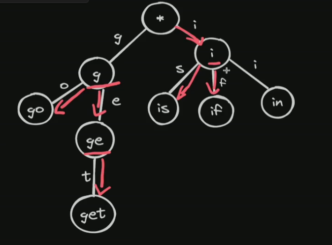

### Trie / Prefix - tree

- Aplicações de auto complete

- Implementação:
  - Nódos

- Métodos:
  - Insert: guarda a palavra na trie
  - Search: busca pela palavra na trie criada anteriormente
  - StartsWith: busca se existe parte da palavra;